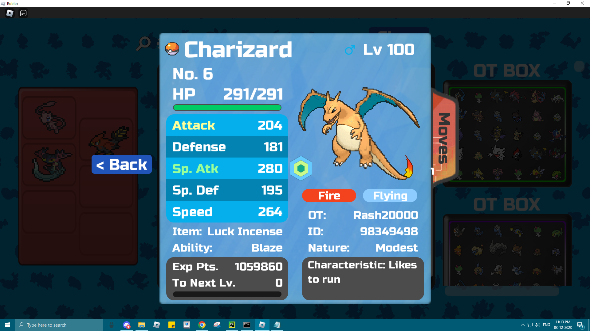

# Pokémon Data Capture Script

This script captures information about Pokémon from your screen, including Pokémon Name, Ability, Original Trainer (OT),
and Trainer ID. 
It saves the captured data to a CSV file and optionally saves screenshots for you to review.
It beeps like a metal detector when it encounters duplicate OT to let you do what you want to do with the poke.

Made it for roblox remakes of pokemon brick bronze, but I can update it and work for any game if you ask me nicely :)

# Know about me
I work as a full time software developer.
Playing roblox Pokémon has been a fun break from reality until I had to deal with the dread of sorting OT for the cursed daily lotto.
Here. use this script. save yourself some hair.


If you liked this program or hated it, message me on 
   * Discord - rash2000 (455620017531256834)
   * Linkedin - https://www.linkedin.com/in/rashil-dudhara/
   * Roblox - https://www.roblox.com/users/98349498/profile

 
Thank you for trying this out. Do let me know what things you found that are good/bad or need to be improved.


# Usage

1) Launch the script and configure settings as prompted.
2) Join Game and iter through your Pokémon in PC
3) Press the hotkey (configured during setup) to capture Pokémon data.
4) Review created CSV default - All_OT_Pokemons.csv eg - [Rashil_031223_All_OT_Pokemons.csv](Rashil_031223_All_OT_Pokemons.csv)


# Screenshots
1) Captures the screen with pokemon details 
  

2) Extracts useful information that you want to track like
* Type/Name 
  
    
* OT ID 
  
    
* OT Name  
    
* Create a workbook for you to review/work off
  
    - [Rashil_031223_All_OT_Pokemons.csv](Rashil_031223_All_OT_Pokemons.csv)
    - yeah. 212 OTs. If you don't know - it means I have Pokémon caught by at least 212 unique players and I got them via trade :D

## Requirements

- Python 3.10 or higher
- Tesseract OCR installed (`C:\Program Files\Tesseract-OCR\tesseract.exe` must be accessible)
  - If you're on windows check out https://github.com/UB-Mannheim/tesseract/wiki . 
  - Including my installation file for your convenience. Keep everything default
    - [tesseract-ocr-w64-setup-5.3.3.20231005.exe](tesseract-ocr-w64-setup-5.3.3.20231005.exe)
- Additional Python packages (install using `pip install -r requirements.txt`)

## Installation

1. Clone the repository:

   ```bash
   git clone https://github.com/Rash20000/roblox-pokemon_OT_capture.git
   ```

2. Install dependencies:

   ```bash
   pip install -r requirements.txt
   ```

3. Run the script:
   python capture_pokemon_data.py

# Configuration

Modify the script variables in capture_pokemon_data.py to customize behavior.

Set debug environment variable to enable debug mode:

```bash
   set debug=True
   ```
# Todo
1) If this doesn't blow up already, create an exe using PyInstaller or cx_Freeze 
2) Add a UI to learn python and to not get called out as a virus omg file delete omg my pc ransomware tech support scam !1!!
3) Keep me motivated enough with this, and I'll update this to include IVs, Natures, Egg-moves and give you a comprehensive excel to make your life super easy. 
 
For now, needs a little bit of beta testing to see how this works off in different resolution monitors.

Sorry playing pokemon don't pay me enough to afford multiple monitors :'(

# Gimme some bottle caps if you liked this >:|